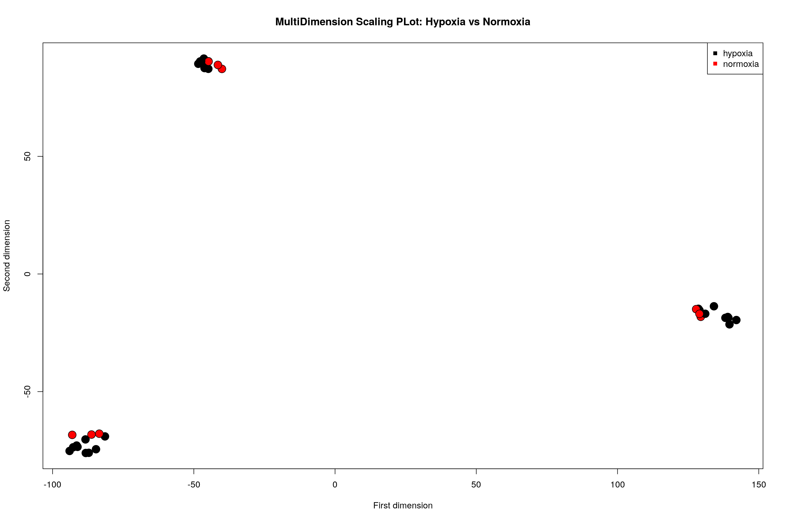
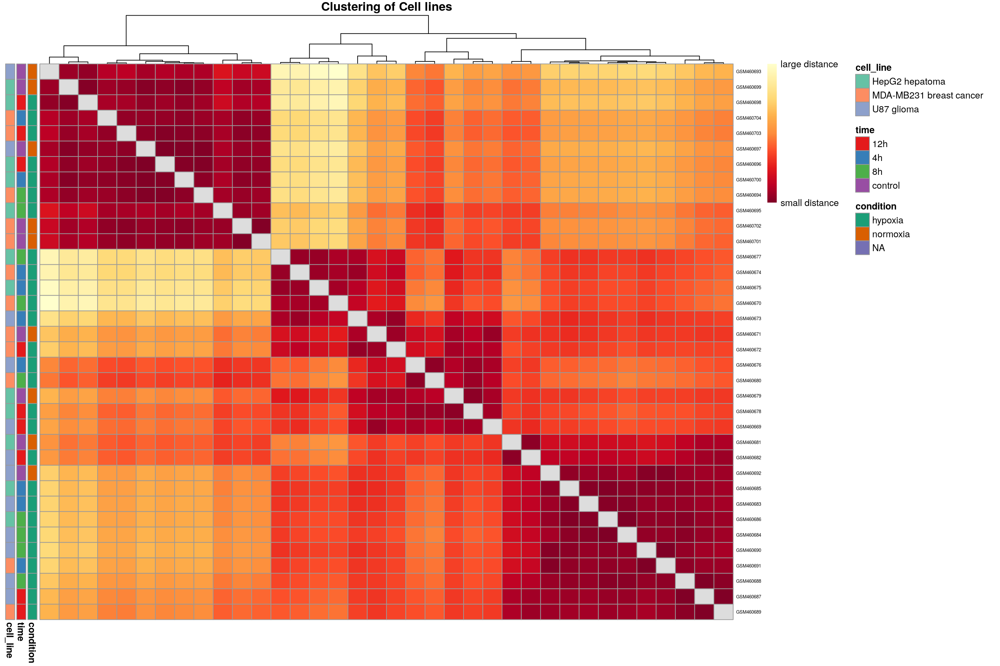
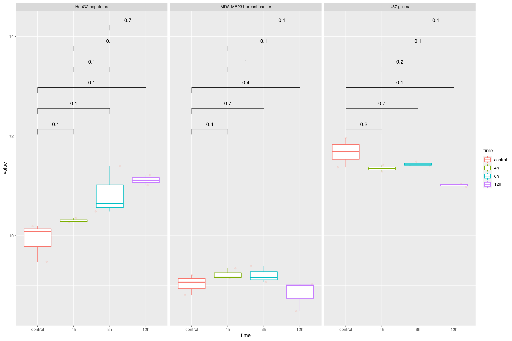

Analysis of Hypoxia and Normoxia on Microarray cell lines (E-GEOD-18494)
================

Expression profiling of hypoxic HepG2 hepatoma, U87 glioma, and
MDA-MB231 breast cancer cells: time course (E-GEOD-18494)

Analysis of expression changes of cultured HepG2 hepatoma, U87 glioma,
and MDA-MB231 breast cancer cells subjected to hypoxia (0.5% O2) for 0,
4, 8, 12 hours . Results provide insight to cell type-specific response
to hypoxia. HepG2 hepatoma, U87 glioma, and MDA-MB231 breast cancer
cells were collected under normoxic conditions (~19% O2, 0 hours) and
after 4, 8 and 12 hours of hypoxia treatment (0.5% O2). For each cell
line, three replicates of total RNA at each time point were prepared
using Trizol and submitted to the DFCI Microarray Core for labeling,
hybridization to Affymetrix HG-U133Plus2 oligonucleotide arrays and
image
scanning.

<https://www.ebi.ac.uk/arrayexpress/experiments/E-GEOD-18494/>

``` r
packages_bioconductor = c("Biobase","ArrayExpress", "hgu133plus2.db", "oligo", "DESeq2", "Glimma", "limma", "clusterProfiler", "topGO")

# Install and load packages
package.check <- lapply(packages_bioconductor, FUN = function(x) {
  if (!require(x, character.only = TRUE)) {
    BiocManager::install(x, dependencies = TRUE)
    library(x, character.only = TRUE)
  }
})

packages_cran = c("DT", "tidyverse","dplyr", "tibble", "data.table", "stats", "ggpubr", "ggplot2", "RColorBrewer", "ggrepel", "pheatmap","ComplexHeatmap", "gapminder", "ggstatsplot", "fs")

# For ggstatsplot, might be needed execute:
# sudo apt-get install libgmp-dev
# sudo apt-get install libmpfr-dev

# Install and load packages
package.check <- lapply(packages_cran, FUN = function(x) {
  if (!require(x, character.only = TRUE)) {
    install.packages(x, dependencies = TRUE)
    library(x, character.only = TRUE)
  }
})

rm(package.check, packages_bioconductor, packages_cran)
```

# Import of annotation data and microarray expression data as “ExpressionSet”

``` r
    setwd(".")
    #load("pipeline_EGEOD18494.RData")
    #save.image("pipeline_EGEOD18494.RData")
```

``` r
download_dir <- fs::path(".data_tmp")
if (!dir_exists(download_dir)) {
    dir_create(download_dir)
    egeod18494 <- ArrayExpress( "E-GEOD-18494", path=download_dir)
} else {
    egeod18494 <- ArrayExpress( "E-GEOD-18494", path=download_dir)
}
```

    ## Reading in : .data_tmp/GSM460679.CEL
    ## Reading in : .data_tmp/GSM460699.CEL
    ## Reading in : .data_tmp/GSM460681.CEL
    ## Reading in : .data_tmp/GSM460685.CEL
    ## Reading in : .data_tmp/GSM460700.CEL
    ## Reading in : .data_tmp/GSM460675.CEL
    ## Reading in : .data_tmp/GSM460695.CEL
    ## Reading in : .data_tmp/GSM460686.CEL
    ## Reading in : .data_tmp/GSM460677.CEL
    ## Reading in : .data_tmp/GSM460698.CEL
    ## Reading in : .data_tmp/GSM460678.CEL
    ## Reading in : .data_tmp/GSM460696.CEL
    ## Reading in : .data_tmp/GSM460697.CEL
    ## Reading in : .data_tmp/GSM460693.CEL
    ## Reading in : .data_tmp/GSM460692.CEL
    ## Reading in : .data_tmp/GSM460683.CEL
    ## Reading in : .data_tmp/GSM460676.CEL
    ## Reading in : .data_tmp/GSM460673.CEL
    ## Reading in : .data_tmp/GSM460690.CEL
    ## Reading in : .data_tmp/GSM460684.CEL
    ## Reading in : .data_tmp/GSM460688.CEL
    ## Reading in : .data_tmp/GSM460687.CEL
    ## Reading in : .data_tmp/GSM460669.CEL
    ## Reading in : .data_tmp/GSM460682.CEL
    ## Reading in : .data_tmp/GSM460671.CEL
    ## Reading in : .data_tmp/GSM460702.CEL
    ## Reading in : .data_tmp/GSM460701.CEL
    ## Reading in : .data_tmp/GSM460674.CEL
    ## Reading in : .data_tmp/GSM460691.CEL
    ## Reading in : .data_tmp/GSM460704.CEL
    ## Reading in : .data_tmp/GSM460680.CEL
    ## Reading in : .data_tmp/GSM460670.CEL
    ## Reading in : .data_tmp/GSM460694.CEL
    ## Reading in : .data_tmp/GSM460672.CEL
    ## Reading in : .data_tmp/GSM460703.CEL
    ## Reading in : .data_tmp/GSM460689.CEL

``` r
data_description <- pData(egeod18494)

data_description <- data.frame(
                  codes = substr(data_description$Source.Name,1,9),
                  cell_line = data_description$Characteristics..cell.line.,
                  time = data_description$Characteristics..time,
                  condition = data_description$Characteristics..stress.
                  )

exp <- rma(egeod18494)
```

    ## Background correcting
    ## Normalizing
    ## Calculating Expression

``` r
exp <- exprs(exp)
colnames(exp) <- substr(colnames(exp),1,9)
egeod18494@annotation
```

    ## [1] "pd.hg.u133.plus.2"

``` r
rm(egeod18494)
```

``` r
ensemblAnnot <- AnnotationDbi::select(hgu133plus2.db, keys=rownames(exp), columns=c("ENSEMBL", "SYMBOL", "GENENAME"), keytype="PROBEID")
```

    ## 'select()' returned 1:many mapping between keys and columns

``` r
colnames(ensemblAnnot) <- c("GeneID", "ENSEMBL", "Symbol", "Description")
```

# Quality control of the raw data: PCA of Samples

``` r
PCA_raw <- prcomp(t(exp), scale. = FALSE)

percentVar <- round(100*PCA_raw$sdev^2/sum(PCA_raw$sdev^2),1)
sd_ratio <- sqrt(percentVar[2] / percentVar[1])

dataGG <- cbind(data.frame(PC1 = PCA_raw$x[,1], PC2 = PCA_raw$x[,2]), data_description)

col3 <- guide_legend(ncol = 3)
ggplot(dataGG, aes(PC1, PC2)) +
  geom_point(aes(shape = cell_line, colour = time, size = condition)) +
# geom_point(colour = condition, size = 1) +
  ggtitle("PCA plot of the log-transformed raw expression data") +
  xlab(paste0("PC1, VarExp: ", percentVar[1], "%")) +
  ylab(paste0("PC2, VarExp: ", percentVar[2], "%")) +
  theme(plot.title = element_text(hjust = 0.5))+
  coord_fixed(ratio = sd_ratio) +
  #scale_fill_manual(values =  c(red, "white", "black")) + 
  scale_shape_manual(values = c(0, 1, 2), guide = col3) + 
  scale_color_manual(values = c("darkorange2", "dodgerblue4", "chartreuse4", "chartreuse1"), guide = col3) +
  guides(fill=guide_legend(ncol=3)) +
  theme(
    legend.title = element_text(size = 10),
    legend.text = element_text(size = 8)
  ) 
```

    ## Warning: Using size for a discrete variable is not advised.

<!-- -->

``` r
rm(col3, dataGG, PCA_raw, sd_ratio, percentVar)
```

# MultiDimension Scaling plots by hypoxia vs normoxia conditions

``` r
    dist_matrix<- dist(t(exp)) # very important to take transpose "t"
    mds <- cmdscale(dist_matrix)
    
    #mypar(1,1)
    plot(mds[,1],mds[,2],bg=as.numeric(data_description$condition),pch=21,xlab="First dimension",ylab="Second dimension",cex=2,main="MultiDimension Scaling PLot: Hypoxia vs Normoxia")
    legend("topright",levels(data_description$condition),col=seq(along=levels(data_description$condition)),pch=15,cex=1)
    identify(mds)
```

<!-- -->

    ## integer(0)

# MultiDimension Scaling plots by time conditions

``` r
    dist_matrix<- dist(t(exp)) # very important to take transpose "t"
    mds <- cmdscale(dist_matrix)
    
    #mypar(1,1)
    plot(mds[,1],mds[,2],bg=as.numeric(data_description$time),pch=21,xlab="First dimension",ylab="Second dimension",cex=2,main="MultiDimension Scaling PLot: Hypoxia vs Normoxia")
    legend("topright",levels(data_description$time),col=seq(along=levels(data_description$time)),pch=15,cex=1)
    identify(mds)
```

<!-- -->

    ## integer(0)

``` r
    rm(mds)
```

``` r
    oligo::boxplot(exp, target = "core", 
                   main = "Boxplot of log2-intensitites for the raw data")
```

<!-- -->

# Heatmap clustering analysis

``` r
    annotation_for_heatmap <- 
      data.frame(condition = data_description$condition,  time = data_description$time, cell_line = data_description$cell_line
                 )
    
    row.names(annotation_for_heatmap) <- colnames(exp)
    
    dists <- as.matrix(dist(t(exp), method = "manhattan"))
    
    rownames(dists) <- colnames(exp)
    hmcol <- rev(colorRampPalette(RColorBrewer::brewer.pal(9, "YlOrRd"))(255))
    colnames(dists) <- NULL
    diag(dists) <- NA
    
    ann_colors <- list(  
      condition = brewer.pal(length(levels(data_description$condition)), "Dark2"),
      time = brewer.pal(length(levels(data_description$time)), "Set1"),
      cell_line = brewer.pal(length(levels(data_description$cell_line)), "Set2")
    )
```

    ## Warning in brewer.pal(length(levels(data_description$condition)), "Dark2"): minimal value for n is 3, returning requested palette with 3 different levels

``` r
    names(ann_colors$condition) <- levels(data_description$condition)    
    names(ann_colors$time) <- levels(data_description$time)
    names(ann_colors$cell_line) <- levels(data_description$cell_line)
    
    pheatmap(dists, col = (hmcol), 
             annotation_row = annotation_for_heatmap,
             annotation_colors = ann_colors,
             legend = TRUE, 
             treeheight_row = 0,
             legend_breaks = c(min(dists, na.rm = TRUE), 
                               max(dists, na.rm = TRUE)), 
             legend_labels = (c("small distance", "large distance")),
             main = "Clustering of Cell lines",
             fontsize_row = 5)
```

<!-- -->

``` r
    rm(ann_colors, hmcol, dists, annotation_for_heatmap )
```

# Selecting the HIF Genes

``` r
# Genes from "Dynamical analysis of a generic Boolean model for the control of the mammalian cell cycle"
# Adrien Fauré  1 , Aurélien Naldi, Claudine Chaouiya, Denis Thieffry
# PMID: 16873462 DOI: 10.1093/bioinformatics/btl210 
# CycD Rb E2F CycE CycA p27 Cdc20 Cdh1 UbcH10 CycB

# Genes from Our Boolean Network:    
# HIF1a, HIF2a, p53, BNIP3, VEGF, cMyc, Oct4, cdc20, cycA, cycB, cycE, cycD, p27, Rb, E2F, cdh1, mdm2, BAD, BclX


genes_HIF <- c('HIF1A', 'EPAS1', 'TP53', 'BNIP3', 'VEGFA', 'VEGFB', 'VEGFC', 'VEGFD', 'MYC', 
               'POU5F1', 'CDC20', 'CDC20B', 'CCNA2', 'CCNB1', 'CCNE1', 'CCNE2', 'CCND1', "AKIP1", 'CDKN1B', 
               'RB1', 'E2F1', 'E2F2', 'CDH1', 'MDM2', 'BAD', 'BCL2', 'MCL1')

genes_HIF_probes <- ensemblAnnot$GeneID[ensemblAnnot$Symbol %in% genes_HIF]

exp_hif <- data.frame(exp[genes_HIF_probes, ])
exp_hif$GeneID <- rownames(exp[genes_HIF_probes, ])

exp_hif <-  merge(exp_hif, 
                  ensemblAnnot[ensemblAnnot$Symbol %in% genes_HIF , 
                               c("GeneID","Symbol")], by = "GeneID")
```

``` r
exp_hif_pivot <- exp_hif %>%
  group_by(Symbol) %>%
  pivot_longer(cols = starts_with("GSM"), names_to = "codes", values_to = "value")

exp_hif_pivot <- merge(exp_hif_pivot, data_description, by = "codes")

exp_hif_pivot$time <- factor(exp_hif_pivot$time,  levels =  c("control", "4h" , "8h" , "12h"))
```

# Comparing expression per cell line

``` r
my_comparisons=list(c("control","4h"), c("control","8h"), c("control","12h"), c("4h","8h"), c("4h","12h"), c("8h","12h"))


ggplot(exp_hif_pivot[exp_hif_pivot$Symbol == c('HIF1A'), ], aes(x = time, y = value, group = time, color = time)) +
    geom_jitter(alpha = 0.1, color = "tomato") +
    geom_boxplot() + facet_wrap(~ cell_line) + stat_compare_means(comparisons=my_comparisons)
```

<!-- -->

``` r
ggplot(exp_hif_pivot[exp_hif_pivot$Symbol == c('EPAS1'), ], aes(x = time, y = value, group = time, color = time)) +
    geom_jitter(alpha = 0.1, color = "tomato") +
    geom_boxplot() + facet_wrap(~ cell_line) + stat_compare_means(comparisons=my_comparisons)
```

<!-- -->

``` r
ggstatsplot::grouped_ggbetweenstats(
  data = exp_hif_pivot[exp_hif_pivot$Symbol %in%  c('HIF1A', 'EPAS1', 'TP53', 'BNIP3'),],
  x = time,
  y = value,
  grouping.var = Symbol, # grouping variable
  ggplot.component = list(ggplot2::scale_y_continuous(sec.axis = ggplot2::dup_axis())),
#  k = 4,
  title.prefix = "Gene",
  palette = "default_jama",
  package = "ggsci",
  plotgrid.args = list(nrow = 4),
  title.text = "Differences in gene expression for different time",
  messages = FALSE
)
```

<!-- -->

# Another comparison visualization

``` r
  ggplot(exp_hif_pivot[exp_hif_pivot$Symbol == c('EPAS1', 'VEGFA'), ], aes(x = time, y = value, group = time, color = time)) +
    geom_jitter(alpha = 0.1, color = "tomato") +
    geom_boxplot() +
    facet_wrap(~ Symbol)  +
    stat_compare_means(comparisons=my_comparisons)  +
    stat_compare_means(label.y = 25, vjust = 2)
```

<!-- -->

``` r
  ggplot(exp_hif_pivot[exp_hif_pivot$Symbol == c('CCNB1', 'BAD'), ], aes(x = time, y = value, group = time, color = time)) +
    geom_jitter(alpha = 0.1, color = "tomato") +
    geom_boxplot() +
    facet_wrap(~ Symbol)  +
    stat_compare_means(comparisons=my_comparisons)  +
    stat_compare_means(label.y = 25, vjust = 2)
```

<!-- -->

<!-- # Pre-processsing RNA-seq data -->

<!--     Based on:  -->

<!--      https://bioinformatics-core-shared-training.github.io/cruk-summer-school-2018/RNASeq2018/html/02_Preprocessing_Data.nb.html  -->

<!-- # Convert counts to DESeqDataSet object -->

<!-- ```{r} -->

<!-- # create the design formula -->

<!--     design <- as.formula(~ condition) -->

<!-- # create the DESeqDataSet object -->

<!--     ddsObj <- DESeqDataSetFromMatrix(countData = exp, -->

<!--                                   colData = data_description, -->

<!--                                   design = design) -->

<!-- ``` -->

<!-- # Normalisation -->

<!-- ```{r} -->

<!-- # Apply normalisation to DDS object -->

<!--     ddsObj <- estimateSizeFactors(ddsObj) -->

<!-- ``` -->

<!-- ```{r} -->

<!--     ddsObj@colData$sizeFactor -->

<!-- ``` -->

<!-- # Interactive StripChart with Glimma -->

<!-- ```{r} -->

<!--     ddsObj <- DESeq(ddsObj) -->

<!--     res <- results(ddsObj) -->

<!--     res.shr <- DESeq2::lfcShrink(ddsObj, coef=2, res=res) -->

<!--     shrink.deseq <- as.data.frame(res.shr) %>% -->

<!--         rownames_to_column("GeneID") %>%  -->

<!--         left_join(ensemblAnnot, by="GeneID") %>%  -->

<!--         rename(logFC=log2FoldChange, FDR=padj) -->

<!-- ``` -->

<!-- ```{r} -->

<!--     summary(res) -->

<!-- ``` -->

<!-- ```{r} -->

<!--     hist(res.shr$pvalue , col = brewer.pal(3, name = "Set2")[1], -->

<!--          main = "Normoxia vs Hypoxia", xlab = "p-values") -->

<!-- ``` -->

<!-- ```{r} -->

<!-- # add a column with the names of only the top 30 genes -->

<!--     cutoff <- sort(res.shr$pvalue)[30] -->

<!-- # first remove the filtered genes (FDR=NA) and create a -log10(FDR) column -->

<!--     filtTab.deseq <- shrink.deseq %>% -->

<!--         filter(!is.na(FDR)) %>% -->

<!--         mutate(`-log10(FDR)` = -log10(FDR)) -->

<!--     filtTab.deseq <- filtTab.deseq %>%  -->

<!--         mutate(`-log10(FDR)`=pmin(`-log10(FDR)`, 51)) -->

<!-- ``` -->

<!-- ```{r} -->

<!--     hist(filtTab.deseq$pvalue, col = brewer.pal(3, name = "Set2")[1], -->

<!--          main = "Normoxia vs Hypoxia - Breast Cancer (Filtered)", xlab = "p-values") -->

<!-- ``` -->

<!-- ```{r} -->

<!-- # get the top genes -->

<!--     sigGenes <- as.data.frame(res.shr) %>%  -->

<!--         rownames_to_column("GeneID") %>%  -->

<!--         top_n(150, wt=-padj) %>%  -->

<!--         pull("GeneID") -->

<!-- # filter the data for the top 200 by padj in the LRT test -->

<!--     plotDat <- vst(ddsObj)[sigGenes,] %>%  -->

<!--         assay() -->

<!--     z.mat <- t(scale(t(plotDat), center=TRUE, scale=TRUE)) -->

<!-- # colour palette -->

<!--     myPalette <- c("red3", "ivory", "blue3") -->

<!--     myRamp = colorRamp2(c(-2, 0, 2), myPalette) -->

<!-- ``` -->

<!-- ```{r} -->

<!-- # cluster the data and split the tree -->

<!--     hcDat <- hclust(dist(z.mat)) -->

<!--     cutGroups <- cutree(hcDat, h=4) -->

<!--     ha1 = HeatmapAnnotation(df = colData(ddsObj)[,c("cell_line", "cancer", "condition")]) -->

<!--     Heatmap(z.mat, name = "z-score", -->

<!--             col = myRamp,             -->

<!--             show_row_name = FALSE, -->

<!--             cluster_columns = FALSE, -->

<!--             split=cutGroups, -->

<!--             rect_gp = gpar(col = "darkgrey", lwd=0.5), -->

<!--             top_annotation = ha1, -->

<!--             row_names_gp = gpar(fontsize = 8), -->

<!--             column_names_gp = gpar(fontsize = 8), -->

<!--             column_names_rot = 45) -->

<!--     rm(hcDat,cutGroups, ha1 ) -->

<!-- ``` -->

<!-- ```{r} -->

<!--     de <- as.integer(filtTab.deseq$FDR <= 0.05) -->

<!--     normCounts <- log2(counts(ddsObj)) -->

<!--     filtCounts <- normCounts[filtTab.deseq$GeneID,] -->

<!--     glXYPlot( -->

<!--       x = filtTab.deseq$logFC, -->

<!--       y = -log10(filtTab.deseq$FDR), -->

<!--       xlab = "logFC", -->

<!--       ylab = "FDR", -->

<!--       main = "Normoxia v Hypoxia", -->

<!--       counts = filtCounts, -->

<!--       groups = data_description$condition, -->

<!--       status = de, -->

<!--       anno = filtTab.deseq[, c("GeneID", "Symbol", "Description")], -->

<!--       folder = "volcano_6647_DEseq2" -->

<!--     ) -->

<!-- ``` -->

<!-- # Selecting the HIF Genes  -->

<!-- ```{r} -->

<!--     filtTab.deseq_HIF <- filtTab.deseq[filtTab.deseq$Symbol %in% genes_HIF, ] -->

<!-- ``` -->

<!-- ```{r} -->

<!--     ggplot(filtTab.deseq_HIF, aes(x = logFC, y=`-log10(FDR)`)) +  -->

<!--         geom_point(aes(colour=FDR < 0.05, shape = `-log10(FDR)` > 50), size=2) -->

<!-- ``` -->

<!-- # Showing a set of selected a Genes from Genecards -->

<!-- ```{r} -->

<!--     filtTab.deseq_HIF[, c("Symbol", "logFC", "FDR", "Description")] -->

<!-- ``` -->

<!-- ```{r} -->

<!--     group <- str_remove_all(data_description$condition, "[aeiou]") -->

<!--     de <- as.integer(filtTab.deseq_HIF$FDR <= 0.05) -->

<!--     normCounts <- log2(counts(ddsObj)) -->

<!--     filtCounts <- normCounts[filtTab.deseq_HIF$GeneID,] -->

<!--     glXYPlot( -->

<!--       x = filtTab.deseq_HIF$logFC, -->

<!--       y = -log10(filtTab.deseq_HIF$FDR), -->

<!--       xlab = "logFC", -->

<!--       ylab = "FDR", -->

<!--       main = "Normoxia v Hypoxia", -->

<!--       counts = filtCounts, -->

<!--       groups = group, -->

<!--       status = de, -->

<!--       anno = filtTab.deseq_HIF[, c("GeneID", "Symbol", "Description")], -->

<!--       folder = "volcano_6647_DEseq2_HIF" -->

<!--     ) -->

<!-- ``` -->

<!-- # Selecting the lower p-values  -->

<!-- ```{r} -->

<!--     nrow(subset(filtTab.deseq, pvalue < 0.001)) -->

<!-- ``` -->

<!-- ```{r}  -->

<!--     tail(subset(filtTab.deseq, pvalue < 0.001), 40)[, c("Symbol", "logFC", "FDR", "pvalue", "Description")] -->

<!-- ``` -->

<!-- # Selecting the lower  Adj. P-Values  -->

<!-- ```{r} -->

<!--     nrow(subset(filtTab.deseq, FDR < 0.001)) -->

<!-- ``` -->

<!-- ```{r}  -->

<!--     tail(subset(filtTab.deseq, FDR < 0.001), 30)[, c("Symbol", "logFC", "FDR", "pvalue", "Description")] -->

<!-- ``` -->

<!-- # Strip chart for gene expression -->

<!-- ```{r} -->

<!-- # Let's look at the most significantly differentially expressed gene -->

<!--     topgene <- filter(shrink.deseq, Symbol=="HIF1A") -->

<!--     geneID <- topgene$GeneID -->

<!--     plotCounts(ddsObj, gene = geneID, intgroup = c("cancer", "condition"), -->

<!--                returnData = T) %>%  -->

<!--         ggplot(aes(x=condition, y=log2(count))) + -->

<!--           geom_point(aes(fill=condition), pch=21, size=2) + -->

<!--           facet_wrap(~cancer) + -->

<!--           expand_limits(y=0) -->

<!-- ``` -->

<!-- ```{r} -->

<!-- # Let's look at the most significantly differentially expressed gene -->

<!--     topgene <- filter(shrink.deseq, Symbol=="HIF1A") -->

<!--     geneID <- topgene$GeneID -->

<!--     plotCounts(ddsObj, gene = geneID, intgroup = c("cell_line", "condition"), -->

<!--                returnData = T) %>%  -->

<!--         ggplot(aes(x=condition, y=log2(count))) + -->

<!--           geom_point(aes(fill=condition), pch=21, size=2) + -->

<!--           facet_wrap(~cell_line) + -->

<!--           expand_limits(y=0) -->

<!-- ``` -->

<!-- ```{r} -->

<!-- # Let's look at the most significantly differentially expressed gene -->

<!--     topgene <- filter(shrink.deseq, Symbol=="TP53") -->

<!--     geneID <- topgene$GeneID -->

<!--     plotCounts(ddsObj, gene = geneID, intgroup = c("cancer", "condition"), -->

<!--                returnData = T) %>%  -->

<!--         ggplot(aes(x=condition, y=log2(count))) + -->

<!--           geom_point(aes(fill=condition), pch=21, size=2) + -->

<!--           facet_wrap(~cancer) + -->

<!--           expand_limits(y=0) -->

<!-- ``` -->

<!-- ```{r} -->

<!-- # Let's look at the most significantly differentially expressed gene -->

<!--     topgene <- filter(shrink.deseq, Symbol=="TP53") -->

<!--     geneID <- topgene$GeneID -->

<!--     plotCounts(ddsObj, gene = geneID, intgroup = c("cell_line", "condition"), -->

<!--                returnData = T) %>%  -->

<!--         ggplot(aes(x=condition, y=log2(count))) + -->

<!--           geom_point(aes(fill=condition), pch=21, size=2) + -->

<!--           facet_wrap(~cell_line) + -->

<!--           expand_limits(y=0) -->

<!-- ``` -->

<!-- # Running Limma Differential Expression -->

<!-- ```{r} -->

<!--     RunLimma <- function(gset,groups){ -->

<!--       design_matrix <- model.matrix(~0+groups) -->

<!--       design_matrix <- design_matrix[, c(2,1)] -->

<!--       colnames(design_matrix) <- str_remove_all(colnames(design_matrix), "groups") -->

<!--   # to check order is correct -->

<!--   # head(design_matrix) -->

<!--       vm <- voomWithQualityWeights(gset, design=design_matrix) -->

<!--       ## fit linear model for each gene given a series of arrays -->

<!--       fit <- lmFit(vm, design_matrix) -->

<!--       ## tell which levels should be compared -->

<!--       #colnames(design_matrix) -->

<!--       cont.matrix <- cbind(Norm.vs.Hypo=c(-1,1)) -->

<!--       #cont.matrix <- makeContrasts(CONTROL-TREATMENT, levels=design_matrix) -->

<!--       ## given a linear model fit to microarray data, compute estimated coefficients & standard errors for given set of contratsts -->

<!--       fit2 <- contrasts.fit(fit, cont.matrix) -->

<!--       fit2 <- eBayes(fit2, 0.05) -->

<!--       ## to get the no.of genes in each array -->

<!--       nrow_gset <- length(featureNames(gset)) -->

<!--       tT <- topTable(fit2, adjust="fdr", sort.by="logFC",number=nrow_gset) -->

<!--  # colnames(tT) #  -->

<!--  # tT <- subset(tT, select=c("ID","adj.P.Val","P.Value","logFC","t","B","AveExpr","GENE_SYMBOL","GENE_NAME","ENSEMBL_ID","REFSEQ","GB_ACC","UNIGENE_ID", "DESCRIPTION", "GO_ID", "LOCUSLINK_ID" )) -->

<!--       return(tT) -->

<!--     } -->

<!--     rownames(data_description) <- data_description$codes -->

<!--     eset <- ExpressionSet(assayData=as.matrix(log2(exp + 1)), phenoData=AnnotatedDataFrame(data=data_description))  -->

<!--     groups <- str_remove_all(data_description$condition, "[aeiou]") -->

<!--     res.limma <- RunLimma(eset,groups) -->

<!--     shrink.limma <- as.data.frame(res.limma) %>% -->

<!--         rownames_to_column("GeneID") %>%  -->

<!--         left_join(ensemblAnnot, by="GeneID") %>%  -->

<!--         rename(FDR=adj.P.Val, pvalue=P.Value, baseMean=AveExpr) -->

<!-- # # volcano plot -->

<!--     #plot(shrink.limma$logFC,-log10(shrink.limma$FDR), xlab="Effect size",ylab="- log (base 10) adj.p-values",main="Volcano Plot for Normoxia vs Hypoxia (Limma)") -->

<!-- ``` -->

<!-- ```{r} -->

<!--     groups <- str_remove_all(data_description$condition, "[aeiou]") -->

<!--     design <- model.matrix(~0+groups) -->

<!--     design <- design[, c(2,1)] -->

<!--     colnames(design) <- str_remove_all(colnames(design), "groups") -->

<!--     contrasts <- cbind(Norm.vs.Hypo=c(-1,1)) -->

<!--     vm <- voomWithQualityWeights(eset, design=design) -->

<!--     fit <- lmFit(vm, design=design) -->

<!--     fit <- contrasts.fit(fit, contrasts) -->

<!--     fit <- eBayes(fit) -->

<!--     dt <- decideTests(fit) -->

<!--     vennDiagram(dt, include=c("up","down")) -->

<!--     print(summary(dt)) -->

<!-- ``` -->

<!-- # Limma -->

<!-- ```{r} -->

<!-- # add a column with the names of only the top 20 genes -->

<!--     cutoff <- sort(shrink.limma$pvalue)[20] -->

<!--     shrink.limma  <- shrink.limma %>%  -->

<!--        mutate(TopGeneLabel=ifelse(pvalue<=cutoff, Symbol, "")) -->

<!--     ggplot(shrink.limma , aes(x = log2(baseMean), y=logFC, label=TopGeneLabel)) +  -->

<!--         geom_point(aes(colour=FDR < 0.05), pch=20, size=0.5) + -->

<!--         labs(x="mean of normalised counts", y="log fold change") +  -->

<!--         geom_text_repel() -->

<!-- ``` -->

<!-- # DEseq -->

<!-- ```{r} -->

<!--     shrink.deseq <- shrink.deseq %>%  -->

<!--        mutate(TopGeneLabel=ifelse(pvalue<=cutoff, Symbol, "")) -->

<!--     ggplot(shrink.deseq, aes(x = log2(baseMean), y=logFC, label=TopGeneLabel)) +  -->

<!--         geom_point(aes(colour=FDR < 0.05), pch=20, size=0.5) + -->

<!--         labs(x="mean of normalised counts", y="log fold change") +  -->

<!--         geom_text_repel() -->

<!-- ``` -->

<!-- # Limma -->

<!-- ```{r} -->

<!--     cutoff <- sort(shrink.limma$pvalue)[20] -->

<!-- # first remove the filtered genes (FDR=NA) and create a -log10(FDR) column   -->

<!--     filtTab.limma <- shrink.limma %>%  -->

<!--         filter(!is.na(FDR)) %>%  -->

<!--         mutate(`-log10(FDR)` = -log10(FDR)) %>%  -->

<!--         mutate(TopGeneLabel=ifelse(pvalue<=cutoff, Symbol, "")) -->

<!--     filtTab.limma <- filtTab.limma[!duplicated(filtTab.limma$GeneID),] -->

<!--     rownames(filtTab.limma) <- filtTab.limma$GeneID -->

<!--     ggplot(filtTab.limma, aes(x = logFC, y=`-log10(FDR)`, label=TopGeneLabel)) +  -->

<!--         geom_point(aes(colour=FDR < 0.05), size=2) + -->

<!--         geom_text_repel() -->

<!-- ``` -->

<!-- # DEseq -->

<!-- ```{r} -->

<!--     filtTab.deseq <- shrink.deseq %>%  -->

<!--         filter(!is.na(FDR)) %>%  -->

<!--         mutate(`-log10(FDR)` = -log10(FDR)) %>%  -->

<!--         mutate(TopGeneLabel=ifelse(pvalue<=cutoff, Symbol, "")) -->

<!-- ``` -->

<!-- ```{r} -->

<!--     DE <- c("downregulated", "notDE", "upregulated")[as.factor(dt)] -->

<!--     anno <- as.data.frame(cbind(data.frame(GeneID=rownames(fit)), DE)) -->

<!--     anno <- as.data.frame(cbind(anno, filtTab.limma[anno$GeneID, c("Symbol", "Description")])) -->

<!--     rownames(anno) <- anno$GeneID     -->

<!--     glXYPlot( -->

<!--       x = filtTab.limma$logFC[anno$GeneID], -->

<!--       y = -log10(filtTab.limma$FDR[anno$GeneID]), -->

<!--       xlab = "logFC", -->

<!--       ylab = "FDR", -->

<!--       main = "Normoxia vs Hypoxia", -->

<!--       anno=anno,  -->

<!--       display.columns=c("GeneID", "Symbol", "GeneName", "DE", "Description"), -->

<!--       counts = filtCounts, -->

<!--       groups = data_description$condition, -->

<!--       status = de, -->

<!--       folder = "volcano_6647_limma" -->

<!--     ) -->

<!-- ``` -->

<!-- ```{r} -->

<!--     de <- as.integer(filtTab.limma$FDR[anno$GeneID] <= 0.05) -->

<!--     filtCounts <- exp[anno$GeneID,] -->

<!--     logFC <- filtTab.limma$logFC[filtTab.limma$GeneID %in% anno$GeneID] -->

<!--     cols <- c("yellow","blue","magenta") -->

<!--     sample.cols <- c("limegreen", "purple")[data_description$condition] -->

<!--     glXYPlot(x=fit$coef, y=fit$lod, xlab="logFC", ylab="logodds",status=dt, anno=anno, side.main="GeneID",counts=vm, groups=data_description$condition, sample.cols=sample.cols, -->

<!--              folder = "volcano_6647_limma_DE_condition" -->

<!--              ) -->

<!-- ``` -->

<!-- ```{r} -->

<!-- deseq.df <- filtTab.deseq[, c("Symbol", "logFC", "GeneID")] -->

<!-- limma.df  <- filtTab.limma[, c("Symbol", "logFC", "GeneID")] -->

<!-- fdr <- p.adjust(fit$p.value[,  ncol(fit)], method = "BH") -->

<!-- limma.fit.df <- data.frame(GeneID = rownames(fit), logFC = fit$coefficients, fdr=fdr, baseMean=fit$Amean) -->

<!-- colnames(limma.fit.df) <- c("GeneID","logFC", "FDR", "baseMean") -->

<!-- limma.fit.df <- cbind(anno[limma.fit.df$GeneID, -1], limma.fit.df)  -->

<!-- save(deseq.df, limma.df, limma.fit.df, file = "DEA_Normoxia.vs.Hypoxia.rda") -->

<!-- rm(deseq.df, limma.df) -->

<!-- ``` -->

<!-- # Gene ontology (GO) based enrichment analysis - only DESeq2 -->

<!-- ```{r} -->

<!--     DE_genes <- subset(filtTab.deseq, FDR < 0.01)$GeneID -->

<!-- ``` -->

<!-- ```{r message=FALSE, warning=FALSE} -->

<!--     back_genes_idx <- genefilter::genefinder(exp,  -->

<!--                                             as.character(DE_genes),  -->

<!--                                             method = "manhattan", scale = "none") -->

<!-- ``` -->

<!-- ```{r} -->

<!--     back_genes_idx <- sapply(back_genes_idx, function(x)x$indices) -->

<!--     back_genes <- rownames(exp)[back_genes_idx] -->

<!--     back_genes <- setdiff(back_genes, DE_genes) -->

<!--     intersect(back_genes, DE_genes) -->

<!--     length(back_genes) -->

<!-- ``` -->

<!-- ```{r} -->

<!--     multidensity(list( -->

<!--             all = log(filtTab.deseq[,"baseMean"]), -->

<!--             fore = log(filtTab.deseq[filtTab.deseq$GeneID %in% DE_genes , "baseMean"]), -->

<!--             back = log(filtTab.deseq[filtTab.deseq$GeneID %in% back_genes, "baseMean"])), -->

<!--             col = c("#e46981", "#ae7ee2", "#a7ad4a"), -->

<!--          xlab = "mean expression", -->

<!--        main = "DE genes for Hypoxia background-matching") -->

<!-- ``` -->

<!--     When comparing the “background gene” curve to the “foreground gene” curve, we see a similar curve shape, indicating a sensible background matching (Figure above). Note that the right-shift of the “foreground-gene” curve in comparison to the “background-gene” curve indicates that DE-genes are generally very highly expressed, so that it wasn’t possible to find background-genes with exactly equal overall expression distribution. -->

<!--     The “all gene” curve has the leftmost curve maximum with a bimodality; this can be explained by a high number of lowly expressed genes in all samples and shows that a foreground matching is sensible in order to avoid biases.  -->

<!-- # Running topGO - Only DEseq  -->

<!-- ```{r} -->

<!--     gene_IDs <- filtTab.deseq$GeneID -->

<!--     in_universe <- gene_IDs %in% c(DE_genes, back_genes) -->

<!--     in_selection <- gene_IDs %in% DE_genes  -->

<!--     all_genes <- in_selection[in_universe] -->

<!--     all_genes <- factor(in_selection[in_universe]) -->

<!--     names(all_genes) <- gene_IDs[in_universe]  -->

<!-- ``` -->

<!-- ```{r} -->

<!--     top_GO_data <- new("topGOdata", ontology = "BP", allGenes = all_genes, -->

<!--      nodeSize = 10, annot=annFUN.org, mapping="org.Hs.eg.db", ID="Ensembl") -->

<!-- ``` -->

<!-- ```{r} -->

<!--     result_top_GO_elim <-  -->

<!--       runTest(top_GO_data, algorithm = "elim", statistic = "Fisher") -->

<!--     result_top_GO_classic <-  -->

<!--       runTest(top_GO_data, algorithm = "classic", statistic = "Fisher") -->

<!-- ``` -->

<!-- ```{r} -->

<!--     library(Biobase) -->

<!--     library(org.Hs.eg.db) -->

<!--     #library(org.Hs.egENSEMBL) -->

<!--     res_top_GO <- GenTable(top_GO_data, Fisher.elim = result_top_GO_elim, -->

<!--             Fisher.classic = result_top_GO_classic, -->

<!--             orderBy = "Fisher.elim" , topNodes = 100) -->

<!-- # genes_top_GO <- printGenes(top_GO_data, whichTerms = res_top_GO$GO.ID, -->

<!-- #    chip = "org.Hs.eg.db",  geneCutOff = 1000) -->

<!-- #  -->

<!-- # res_top_GO$sig_genes <- sapply(genes_top_GO, function(x){ -->

<!-- #                str_c(paste0(x[x$'raw p-value' == 2, "Symbol.id"],";"), -->

<!-- #                      collapse = "") -->

<!-- #    }) -->

<!--     head(res_top_GO[,1:8], 20) -->

<!-- ``` -->

<!-- ```{r} -->

<!--     ensembl_ids <- mapIds(org.Hs.eg.db, -->

<!--           keys = filtTab.deseq$GeneID, -->

<!--           keytype = "ENSEMBL", -->

<!--           column = c("ENTREZID")) -->

<!--     ensembl_ids <- ensembl_ids[!is.na(ensembl_ids)] -->

<!-- ``` -->

<!-- ```{r} -->

<!--     reactome_enrich <- enrichPathway(gene = ensembl_ids[DE_genes], -->

<!--                                     universe = ensembl_ids[c(DE_genes, -->

<!--                                                             back_genes)], -->

<!--                                     organism = "human", -->

<!--                                     pvalueCutoff = 0.05, -->

<!--                                     qvalueCutoff = 0.9, -->

<!--                                     readable = TRUE) -->

<!--     reactome_enrich@result$Description <- paste0(str_sub( -->

<!--                                         reactome_enrich@result$Description, 1, 20), -->

<!--                                         "...") -->

<!--     head(as.data.frame(reactome_enrich))[1:6] -->

<!--     #save.image("maEndToEnd_6647_pdf.RData") -->

<!-- ``` -->

<!-- ```{r} -->

<!--     barplot(reactome_enrich) -->

<!-- ``` -->

<!-- ```{r} -->

<!--     emapplot(reactome_enrich, showCategory = 10) -->

<!-- ``` -->

<!-- # Gene ontology (GO) based enrichment analysis with deSeq and Limma -->

<!-- ```{r} -->

<!--     DE_genes <- subset(filtTab.limma[filtTab.deseq$GeneID, ], FDR < 0.01)$GeneID -->

<!-- ``` -->

<!-- ```{r message=FALSE, warning=FALSE} -->

<!--     back_genes_idx <- genefilter::genefinder(exp,  -->

<!--                                             as.character(DE_genes),  -->

<!--                                             method = "manhattan", scale = "none") -->

<!-- ``` -->

<!-- ```{r} -->

<!--     back_genes_idx <- sapply(back_genes_idx, function(x)x$indices) -->

<!--     back_genes <- rownames(exp)[back_genes_idx] -->

<!--     back_genes <- setdiff(back_genes, DE_genes) -->

<!--     intersect(back_genes, DE_genes) -->

<!--     length(back_genes) -->

<!-- ``` -->

<!-- ```{r} -->

<!--     multidensity(list( -->

<!--             all = log(filtTab.deseq[,"baseMean"]), -->

<!--             fore = log(filtTab.deseq[filtTab.deseq$GeneID %in% DE_genes , "baseMean"]), -->

<!--             back = log(filtTab.deseq[filtTab.deseq$GeneID %in% back_genes, "baseMean"])), -->

<!--             col = c("#e46981", "#ae7ee2", "#a7ad4a"), -->

<!--          xlab = "mean expression", -->

<!--        main = "DE genes for Hypoxia background-matching") -->

<!-- ``` -->

<!--     When comparing the “background gene” curve to the “foreground gene” curve, we see a similar curve shape, indicating a sensible background matching (Figure above). Note that the right-shift of the “foreground-gene” curve in comparison to the “background-gene” curve indicates that DE-genes are generally very highly expressed, so that it wasn’t possible to find background-genes with exactly equal overall expression distribution. -->

<!--     The “all gene” curve has the leftmost curve maximum with a bimodality; this can be explained by a high number of lowly expressed genes in all samples and shows that a foreground matching is sensible in order to avoid biases.  -->

<!-- # Running topGO - Intersection DEseq and Limma -->

<!-- ```{r} -->

<!--     gene_IDs <- filtTab.limma$GeneID[filtTab.limma$GeneID %in% filtTab.deseq$GeneID] -->

<!--     in_universe <- gene_IDs %in% c(DE_genes, back_genes) -->

<!--     in_selection <- gene_IDs %in% DE_genes  -->

<!--     all_genes <- in_selection[in_universe] -->

<!--     all_genes <- factor(in_selection[in_universe]) -->

<!--     names(all_genes) <- gene_IDs[in_universe]  -->

<!-- ``` -->

<!-- ```{r} -->

<!--     top_GO_data <- new("topGOdata", ontology = "BP", allGenes = all_genes, -->

<!--      nodeSize = 10, annot=annFUN.org, mapping="org.Hs.eg.db", ID="Ensembl") -->

<!-- ``` -->

<!-- ```{r} -->

<!--     result_top_GO_elim <-  -->

<!--       runTest(top_GO_data, algorithm = "elim", statistic = "Fisher") -->

<!--     result_top_GO_classic <-  -->

<!--       runTest(top_GO_data, algorithm = "classic", statistic = "Fisher") -->

<!-- ``` -->

<!-- ```{r} -->

<!--     library(Biobase) -->

<!--     library(org.Hs.eg.db) -->

<!--     #library(org.Hs.egENSEMBL) -->

<!--     res_top_GO <- GenTable(top_GO_data, Fisher.elim = result_top_GO_elim, -->

<!--             Fisher.classic = result_top_GO_classic, -->

<!--             orderBy = "Fisher.elim" , topNodes = 100) -->

<!-- # genes_top_GO <- printGenes(top_GO_data, whichTerms = res_top_GO$GO.ID, -->

<!-- #    chip = "org.Hs.eg.db",  geneCutOff = 1000) -->

<!-- #  -->

<!-- # res_top_GO$sig_genes <- sapply(genes_top_GO, function(x){ -->

<!-- #                str_c(paste0(x[x$'raw p-value' == 2, "Symbol.id"],";"), -->

<!-- #                      collapse = "") -->

<!-- #    }) -->

<!--     head(res_top_GO[,1:8], 20) -->

<!-- ``` -->

<!-- ```{r} -->

<!--     ensembl_ids <- mapIds(org.Hs.eg.db, -->

<!--           keys = filtTab.limma$GeneID, -->

<!--           keytype = "ENSEMBL", -->

<!--           column = c("ENTREZID")) -->

<!--     ensembl_ids <- ensembl_ids[!is.na(ensembl_ids)] -->

<!-- ``` -->

<!-- ```{r} -->

<!--     reactome_enrich <- enrichPathway(gene = ensembl_ids[DE_genes], -->

<!--                                     universe = ensembl_ids[c(DE_genes, -->

<!--                                                             back_genes)], -->

<!--                                     organism = "human", -->

<!--                                     pvalueCutoff = 0.05, -->

<!--                                     qvalueCutoff = 0.9, -->

<!--                                     readable = TRUE) -->

<!--     reactome_enrich@result$Description <- paste0(str_sub( -->

<!--                                         reactome_enrich@result$Description, 1, 20), -->

<!--                                         "...") -->

<!--     head(as.data.frame(reactome_enrich))[1:6] -->

<!--     #save.image("maEndToEnd_6647_pdf.RData") -->

<!-- ``` -->

<!-- ```{r} -->

<!--     barplot(reactome_enrich) -->

<!-- ``` -->

<!-- ```{r} -->

<!--     emapplot(reactome_enrich, showCategory = 10) -->

<!-- ``` -->

<!-- ```{r} -->

<!-- save.image("maEndToEnd_6647.RData") -->

<!-- ``` -->
