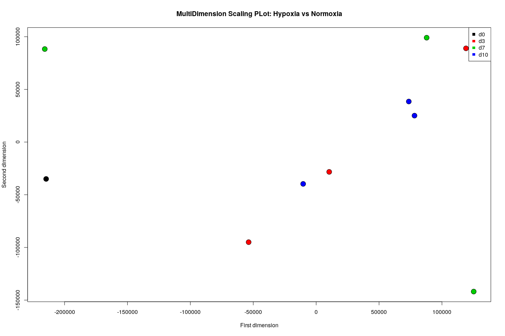

Analysis of Hypoxia and Normoxia on RNA-Seq (GSE142867)
================

Full pipeline of DEA with Glimma - Comparing gene expression of Normoxia
vs Hypoxia.

This experiment performed RNA-sequencing on erythropoietic cells
cultured in normoxia or hypoxia at days 3,7, and 10. Has found numerous
expression changes induced by hypoxia, including the canonical hypoxia
targets as well as a number of genes encoding genes involved in
epigenetic processes.

<https://www.ncbi.nlm.nih.gov/geo/query/acc.cgi?acc=GSE142867>

  - This pipeline if based on the Workflow
:

<https://www.bioconductor.org/packages/devel/workflows/vignettes/maEndToEnd/inst/doc/MA-Workflow.html>

  - Check the preprocessing of Fasta files
with:

<https://www.bioconductor.org/packages/devel/workflows/vignettes/rnaseqGene/inst/doc/rnaseqGene.html>

# Installing and Loading Libraries

``` r
packages_bioconductor = c("DESeq2", "Glimma", "ArrayExpress", "GEOquery", "oligo", "biobroom", "Biobase")

# Install and load packages
package.check <- lapply(packages_bioconductor, FUN = function(x) {
  if (!require(x, character.only = TRUE)) {
    BiocManager::install(x, dependencies = TRUE)
    library(x, character.only = TRUE)
  }
})

packages_cran = c("DT", "tidyverse","dplyr", "tibble", "stringr", "data.table", "genefilter", "stats", "ggpubr", "ggplot2", "RColorBrewer", "ggrepel", "pheatmap","ComplexHeatmap", "curl", "urltools", "xml2", "fs", "rtracklayer","gapminder", "ggstatsplot", "annotables")
  
# Install and load packages
package.check <- lapply(packages_cran, FUN = function(x) {
  if (!require(x, character.only = TRUE)) {
    install.packages(x, dependencies = TRUE)
    library(x, character.only = TRUE)
  }
})

# If you haven't already installed devtools...
#install.packages("devtools")

# Use devtools to install the package
#devtools::install_github("stephenturner/annotables")

rm(package.check, packages_bioconductor, packages_cran)
```

# Download - Expression Data

First, we download data for GSE142867 from
[GEO](https://www.ncbi.nlm.nih.gov/geo/).

Let’s put all of our downloaded data into a single directory.

``` r
# fs: croos-platform file system operations
download_dir <- fs::path(".data_tmp")

file <- paste0(download_dir, "/GSE142867_series_matrix.txt.gz")

# GEOquery 
if (file.exists(file)) {
  GSE142867 <- getGEO(filename=file)
} else {
  dir_create(download_dir)
  GSE142867 <- getGEO("GSE142867", destdir=download_dir)[1]
}
```

# Load expression data

``` r
## creating a dataset with expression values from experiments
path <- paste0(download_dir, "/GSE142867/")

ff <- list.files(path = path, pattern = "fpkm_tracking", include.dirs = FALSE)

if (length(ff) < 1) {
    GSE142867_path <- getGEOSuppFiles("GSE142867", baseDir = download_dir)
    untar(paste0(path,"GSE142867_RAW.tar"), exdir = path)
    ff <- list.files(pattern = ".gz")
    lapply(ff, function(x) gunzip(x, overwrite=TRUE))
    # Sellecting only the Samples GSM4246818 to GSM4246827 of RNA-Seq
    ff <- list.files(pattern = "fpkm_tracking")
} 

ff <- paste0(path, list.files(path = path, pattern = "fpkm_tracking"))
  
counts <- read.table(ff[1],header = T, sep="\t", stringsAsFactors=F, quote="")
counts <- counts[, c("gene_id", "gene_short_name", "locus")]
names(counts) <- c("gene_id", "gene_short_name", "locus")

for(f in ff){
  reads <- read.table(f, header = T, sep="\t", stringsAsFactors=F, quote="")
  reads <- reads[, c("gene_id", "gene_short_name", "locus", "FPKM")]
  names(reads) <- c("gene_id", "gene_short_name", "locus", substr(f,21,30))
  counts <- merge(counts, reads, by = c("gene_id", "gene_short_name", "locus"), all = TRUE)
}

# Checking duplicate entries
sum(duplicated(counts$gene_short_name))
```

    ## [1] 3034

``` r
sum(duplicated(counts$gene_id))
```

    ## [1] 159

``` r
sum(duplicated(counts$locus))
```

    ## [1] 8

``` r
# Removing duplicated genome regions and arranging expression and annotation datasets
counts$gene_id <- substr(counts$gene_id,1,15)
counts <- counts[!duplicated(counts$gene_id), ]

rownames(counts) <- counts$gene_id 

exp.GSE142867 <- counts %>% dplyr::select(starts_with("GSM"))

# Removing the locus and seting the ensgene as rowname
anno.GSE142867 <- counts[,c("gene_id", "gene_short_name")]
names(anno.GSE142867) <- c("ensgene", "symbol")

rm(path, file, reads, f, ff, counts)
rm(download_dir)
```

# Select BioMart database and dataset

``` r
library(annotables)

anno.GSE142867 <- grch38 %>% 
  filter(grch38$ensgene %in%  unique(anno.GSE142867$ensgene)) %>% 
  dplyr::select(ensgene, symbol, description) %>% 
  merge(., anno.GSE142867[,c("symbol","ensgene")], by = "ensgene", all.y = T) %>% 
  dplyr::select(ensgene, symbol.y, description) %>% 
  rename(symbol = "symbol.y") %>%
  distinct(ensgene, .keep_all = TRUE)
  
rownames(anno.GSE142867) <- anno.GSE142867$ensgene
```

# Harmonizating Expression and clinical Data

``` r
data.GSE142867 <- pData(GSE142867) %>% 
  select('geo_accession', 'treatment:ch1', 'source_name_ch1', 'time point:ch1', 'title') %>%
  rename(codes = 'geo_accession',
         condition = 'treatment:ch1',
         cell_line = 'source_name_ch1',
         time = 'time point:ch1') %>% 
  droplevels() %>% 
  mutate(condition = fct_recode(condition, 
                                'normoxia'='21% oxygen',
                                'hypoxia'='1% oxygen'),
         time = fct_recode(time, 
                                'd0'='Day 0',
                                'd3'='Day 3',
                                'd7'='Day 7',
                                'd10'='Day 10')) %>%
  mutate(condition = factor(condition, levels = c('normoxia','hypoxia')),
         time = factor(time, levels = c('d0', 'd3', 'd7', 'd10')))  
  
  

data.GSE142867$rep <- data.GSE142867$title %>% 
                      as.character(.) %>%
                      strsplit( "rep " ) %>%
                      sapply( "[", 2 ) %>% str_replace_na(replacement="1")

row.names(data.GSE142867) <- data.GSE142867$codes

# Arrange the expression data and the data description on same order:
exp.GSE142867 <- exp.GSE142867[,data.GSE142867$codes]
```

# Quality control of the raw data: PCA of Samples

``` r
#library(stats)

PCA_raw <- prcomp(t(exp.GSE142867), scale. = FALSE)

percentVar <- round(100*PCA_raw$sdev^2/sum(PCA_raw$sdev^2),1) # ???
sd_ratio <- sqrt(percentVar[2] / percentVar[1])

dataGG <- cbind(data.frame(PC1 = PCA_raw$x[,1], PC2 = PCA_raw$x[,2]), data.GSE142867) 

col3 <- guide_legend(ncol = 3)

# Pode excluir shape (cell line)
ggplot(dataGG, aes(PC1, PC2)) +
geom_point(aes(colour = time, 
               size = condition)) +
# geom_point(colour = condition, size = 1) +
ggtitle("PCA plot of the log-transformed raw expression data") +
xlab(paste0("PC1, VarExp: ", percentVar[1], "%")) +
ylab(paste0("PC2, VarExp: ", percentVar[2], "%")) +
theme(plot.title = element_text(hjust = 0.5))+
coord_fixed(ratio = sd_ratio) +
#scale_fill_manual(values =  c(red, "white", "black")) + 
scale_shape_manual(values = c(0, 1, 2), guide = col3) + 
scale_color_manual(values = c("darkorange2", "dodgerblue4", "chartreuse4", "chartreuse1"), guide = col3) +
guides(fill=guide_legend(ncol=3)) +
theme(
  legend.title = element_text(size = 10),
  legend.text = element_text(size = 8)
) 
```

    ## Warning: Using size for a discrete variable is not advised.

<!-- -->

``` r
rm(col3, dataGG, PCA_raw, sd_ratio, percentVar)
```

# MultiDimension Scaling plots by conditions and time

``` r
dist_matrix<- dist(t(exp.GSE142867)) # very important to take transpose "t"
mds <- cmdscale(dist_matrix)

plot(mds[,1],mds[,2], bg=as.numeric(data.GSE142867$condition),
     pch=21,xlab="First dimension",ylab="Second dimension",
     cex=2,main="MultiDimension Scaling PLot: Hypoxia vs Normoxia")
legend("topright",levels(data.GSE142867$condition),col=seq(along=levels(data.GSE142867$condition)),pch=15,cex=1) 
identify(mds) 
```

<!-- -->

    ## integer(0)

``` r
plot(mds[,1],mds[,2],bg=as.numeric(data.GSE142867$time),
     pch=21,xlab="First dimension",ylab="Second dimension",
     cex=2,main="MultiDimension Scaling PLot: Hypoxia vs Normoxia")
legend("topright",levels(data.GSE142867$time),col=seq(along=levels(data.GSE142867$time)),pch=15,cex=1)
identify(mds)
```

<!-- -->

    ## integer(0)

``` r
rm(mds, dist_matrix)
```

Checking the intensity distributions of the individual arrays, it they
are quite different, this indicates the need for an appropriate
normalization.

``` r
oligo::boxplot(exp.GSE142867, target = "core", 
               main = "Boxplot of log2-intensitites for the raw data")
```

<!-- -->

# Heatmap clustering analysis

``` r
annotation_for_heatmap <- data.frame(time = data.GSE142867$time, condition = data.GSE142867$condition)

row.names(annotation_for_heatmap) <- colnames(exp.GSE142867)

dists <- as.matrix(dist(t(exp.GSE142867), method = "manhattan")) # transforma exp em 1 medida?

rownames(dists) <- colnames(exp.GSE142867)
hmcol <- rev(colorRampPalette(RColorBrewer::brewer.pal(9, "YlOrRd"))(255))
colnames(dists) <- NULL
diag(dists) <- NA 

ann_colors <- list(  
  time = brewer.pal(length(levels(data.GSE142867$time)), "Set1"),
  condition = brewer.pal(length(levels(data.GSE142867$condition)), "Set2")
)
```

    ## Warning in brewer.pal(length(levels(data.GSE142867$condition)), "Set2"): minimal value for n is 3, returning requested palette with 3 different levels

``` r
names(ann_colors$time) <- levels(data.GSE142867$time)
names(ann_colors$condition) <- levels(data.GSE142867$condition)

pheatmap(dists, col = (hmcol), 
         annotation_row = annotation_for_heatmap,
         annotation_colors = ann_colors,
         legend = TRUE, 
         treeheight_row = 0,
         legend_breaks = c(min(dists, na.rm = TRUE), 
                           max(dists, na.rm = TRUE)), 
         legend_labels = (c("small distance", "large distance")),
         main = "Clustering of Cell lines",
         fontsize_row = 5)
```

<!-- -->

``` r
rm(ann_colors, hmcol, dists, annotation_for_heatmap)
```

# Selecting the HIF Genes

``` r
# Genes from "Dynamical analysis of a generic Boolean model for the control of the mammalian cell cycle"
# Adrien Fauré  1 , Aurélien Naldi, Claudine Chaouiya, Denis Thieffry
# PMID: 16873462 DOI: 10.1093/bioinformatics/btl210 
# CycD Rb E2F CycE CycA p27 Cdc20 Cdh1 UbcH10 CycB

# Genes from Our Boolean Network:    
# HIF1a, HIF2a, p53, BNIP3, VEGF, cMyc, Oct4, cdc20, cycA, cycB, cycE, cycD, p27, Rb, E2F, cdh1, mdm2, BAD, BclX

hif.symbols <- c("HIF1A", "HIF1", "PASD8", "MOP1", "EPAS1", "HIF2A", "HLF", "PASD2", "MOP2", "VEGFA", "VPF", "MVCD1", "VEGF-A", "TP53", "P53", "MYC", "C-Myc", "POU5F1", "OCT3", "OTF3", "CDC20", "P55CDC", "CDC20A", "CCNA1", "CCNA1", "CCNA2", "CCN1", "CCNA", "CCNB1", "CCNB", "CCNB1", "CCNB2", "CCNB2", "HsT17299", "CCND1", "PRAD1", "CCND2", "MPPH3", "CCNE1", "CCNE1", "CCNE", "PCCNE1", "CCNE2", "CCNE2", "CCNE", "PCCNE1", "CDKN1B", "KIP1", "P27KIP1", "CDKN4MEN4", "RB1", "PPP1R130", "Pp110", "E2F1", "RBAP-1", "BNIP3", "NIP3", "BCL2", "MCL1", "BCL2L3", "CDH1", "CD324", "UBE2C", "BAD", "BCL2L8", "VHL", "PVHL", "VHL1", "MDM2", "HDM2", "EP300", "P300", "KAT3B")

hif.ensgenes <- unique(anno.GSE142867$ensgene[anno.GSE142867$symbol %in% hif.symbols])

exp.GSE142867.hif <- data.frame(exp.GSE142867[hif.ensgenes, ])

# Saving data with information columns
exp.GSE142867.hif %>%  
  rename_at(vars(data.GSE142867$codes), ~paste0(substr(data.GSE142867$condition,1,4),".", data.GSE142867$time, ".", data.GSE142867$rep)) %>% 
  write.csv(., file = "data/exp.GSE142867.hif.csv", row.names = T)
```

``` r
exp.GSE142867.hif$ensgene <- rownames(exp.GSE142867.hif)
exp.GSE142867.hif$symbol <- anno.GSE142867[exp.GSE142867.hif$ensgene, "symbol"]

exp.GSE142867.hif.pivot <- exp.GSE142867.hif %>%
   pivot_longer(cols = starts_with("GSM"), names_to = "codes", values_to = "value")

exp.GSE142867.hif.pivot <- merge(exp.GSE142867.hif.pivot, data.GSE142867, by = "codes")

# There is some normoxia samples described on time "d3" , "d7" ,and "d10".
exp.GSE142867.hif.pivot$time[exp.GSE142867.hif.pivot$condition == "normoxia"] <- "d0"
```

# Comparing expression

``` r
ggstatsplot::grouped_ggbetweenstats(
  data = exp.GSE142867.hif.pivot[exp.GSE142867.hif.pivot$symbol %in%  c('HIF1A', 'EPAS1', 'TP53', 'BNIP3'),],
  x = condition,
  y = value,
  grouping.var = symbol, # grouping variable
  ggplot.component = list(ggplot2::scale_y_continuous(sec.axis = ggplot2::dup_axis())),
  title.prefix = "Gene",
  palette = "default_jama",
  package = "ggsci",
  plotgrid.args = list(nrow = 4),
  title.text = "Differences in HIF1A gene expression for different cell lines",
  messages = FALSE,
  sub.args = list(type = 1)
)
```

<!-- -->

# Another comparison visualization

``` r
#  c("d0", "d3" , "d7" , "d10")
my_comparisons=list(c("d0","d3"), c("d0","d7"), c("d0","d10"), c("d3","d7"), c("d3","d10"), c("d7","d10"))

  ggplot(exp.GSE142867.hif.pivot[exp.GSE142867.hif.pivot$symbol == c('EPAS1', 'VEGFA'), ], aes(x = time, y = value, group = time, color = time)) +
    geom_jitter(alpha = 0.1, color = "tomato") +
    geom_boxplot() +
    facet_wrap(~ symbol)  +
    stat_compare_means(comparisons=my_comparisons)  +
    stat_compare_means(label.y = 25, vjust = 2)
```

<!-- -->

``` r
  ggplot(exp.GSE142867.hif.pivot[exp.GSE142867.hif.pivot$symbol == c('CCNB1', 'BAD'), ], aes(x = time, y = value, group = time, color = time)) +
    geom_jitter(alpha = 0.1, color = "tomato") +
    geom_boxplot() +
    facet_wrap(~ symbol)  +
    stat_compare_means(comparisons=my_comparisons)  +
    stat_compare_means(label.y = 25, vjust = 2)
```

    ## Warning: Computation failed in `stat_signif()`:
    ## not enough 'y' observations

<!-- -->

# Running DESeq2 Differential Expression

References:

<https://bioinformatics-core-shared-training.github.io/cruk-summer-school-2018/RNASeq2018/html/02_Preprocessing_Data.nb.html>

<https://hbctraining.github.io/DGE_workshop_salmon/lessons/04_DGE_DESeq2_analysis.html>

<http://bioconductor.org/packages/devel/bioc/vignettes/DESeq2/inst/doc/DESeq2.html>

<https://bioconductor.github.io/BiocWorkshops/rna-seq-data-analysis-with-deseq2.html>

<http://bioconductor.org/packages/release/bioc/vignettes/Glimma/inst/doc/Glimma.pdf>

<!-- ```{r} -->

<!-- # create the DESeqDataSet object -->

<!-- ddsObj <- DESeqDataSetFromMatrix(countData = exp.GSE142867, -->

<!--                               colData = data.GSE142867, -->

<!--                               design = ~ condition) -->

<!-- ``` -->

<!-- # Normalisation -->

<!-- ```{r} -->

<!-- # Apply normalisation to DDS object -->

<!-- #ddsObj <- estimateSizeFactors(ddsObj) -->

<!-- ``` -->

<!-- ```{r} -->

<!-- ddsObj@colData$sizeFactor -->

<!-- ``` -->

<!-- # Interactive StripChart with Glimma -->

<!-- ```{r} -->

<!-- ddsObj <- DESeq(ddsObj) -->

<!-- res <- results(ddsObj) -->

<!-- res.shr <- DESeq2::lfcShrink(ddsObj, coef=2, res=res) -->

<!-- shrink.deseq <- as.data.frame(res.shr) %>% -->

<!--     rownames_to_column("ensgene") %>%  -->

<!--     left_join(anno.GSE142867, by="ensgene") %>%  -->

<!--     rename(logFC=log2FoldChange, FDR=padj) -->

<!-- ``` -->

<!-- ```{r} -->

<!--     summary(res) -->

<!-- # out of 19265 with nonzero total read count -->

<!-- # adjusted p-value < 0.1 -->

<!-- # LFC > 0 (up)       : 569, 3% -->

<!-- # LFC < 0 (down)     : 24, 0.12% -->

<!-- # outliers [1]       : 0, 0% -->

<!-- # low counts [2]     : 751, 3.9% -->

<!-- # (mean count < 0) -->

<!-- # [1] see 'cooksCutoff' argument of ?results -->

<!-- # [2] see 'independentFiltering' argument of ?results -->

<!-- ``` -->

<!-- ```{r} -->

<!-- DESeq2::plotMA(res, ylim=c(-5,5)) -->

<!-- ``` -->

<!-- ```{r} -->

<!-- # first remove the filtered genes (FDR=NA) and create a -log10(FDR) column -->

<!-- filtTab.deseq <- shrink.deseq %>% -->

<!--     filter(!is.na(FDR)) %>% -->

<!--     mutate(`-log10(FDR)` = -log10(FDR)) -->

<!--   filtTab.deseq <- filtTab.deseq  %>%  -->

<!--     mutate(`-log10(FDR)`=pmin(`-log10(FDR)`)) -->

<!-- ``` -->

<!-- ```{r} -->

<!-- res.df <- as.data.frame(res.shr) -->

<!-- res.df$log10MeanNormCount <- log10(res.df$baseMean + 1) -->

<!-- idx <-(rowSums(counts(ddsObj)) > 0) -->

<!-- res.df <- res.df[idx,] -->

<!-- res.df$padj[is.na(res.df$padj)] <- 1 -->

<!-- status <- as.numeric(res.df$padj < .1) -->

<!-- glMDPlot(res.df[idx,], -->

<!--          xval="baseMean", -->

<!--          yval="log2FoldChange", -->

<!--          counts=counts(ddsObj)[idx,], -->

<!--          anno=data.frame(ensgene=rownames(ddsObj)[idx]), -->

<!--          groups=ddsObj$condition, -->

<!--          samples=colnames(ddsObj), -->

<!--          status=status, -->

<!--          display.columns=c("ensgene"), -->

<!--          folder = "volcano_GSE142867.deseq_DE", -->

<!--          launch=FALSE) -->

<!-- ``` -->

<!-- ```{r} -->

<!-- de <- as.integer(filtTab.deseq$FDR <= 0.05) -->

<!-- normCounts <- log2(counts(ddsObj)) -->

<!-- filtCounts <- normCounts[filtTab.deseq$ensgene,] -->

<!-- glXYPlot( -->

<!--   x = filtTab.deseq$logFC, -->

<!--   y = -log10(filtTab.deseq$FDR), -->

<!--   xlab = "logFC", -->

<!--   ylab = "FDR", -->

<!--   main = "Norm.vs.Hypo", -->

<!--   counts = filtCounts, -->

<!--   groups = data_description$condition, -->

<!--   status = de, -->

<!--   anno = filtTab.deseq[, c("symbol","ensgene", "description")], -->

<!--   folder = "volcano_GSE142867.deseq_DE", -->

<!--   launch = F -->

<!-- ) -->

<!-- ``` -->
